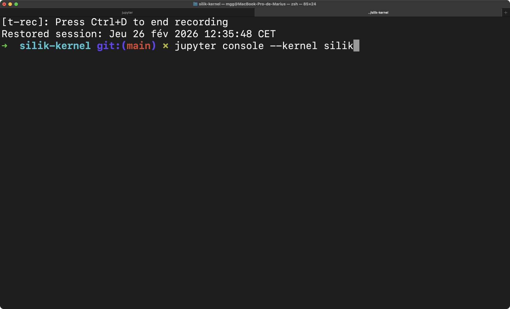

# Silik Kernel

> A Jupyter Multi Kernel Manager, wrapped in a Jupyter Kernel 🙂



This is a jupyter kernel that allows to interface with multiple kernels, you can:

- start, stop and restart kernels,

- switch between kernels,

- list available kernels,

- connect to a living kernel.

A Silik Kernel can be in two modes :

- **`command`** mode : manage kernels (start, stop, ...),

- **`connect`** mode : connects to one kernel, and acts as a gateway with this kernel. Support for TAB completion, and propagation of all sockets is implemented here.

> **Any jupyter kernel can be accessed through silik-kernel**

> But managing interaction between kernels seems to be a nightmare ?

**Not with Agents and LLM**. In order to allow users to easily manage multi-kernels, we present a way to access AI agents through jupyter kernels. To do so, we provide a [wrapper of a pydantic-ai agent in a kernel](https://github.com/mariusgarenaux/pydantic-ai-kernel). This allows to interact easily with these agents, through ipython for example, and let them manage the output of cells.

It also allows to share agents easily (with **pypi** for example); because they can be shipped in a python module. We split properly the agent and the interaction framework with the agent, by reusing the ones from jupyter kernels.

## Getting started

```bash
pip install silik-kernel
```

The kernel is then installed on the current python venv.

Any jupyter frontend should be able to access the kernel, for example :

• **Notebook** (you might need to restart the IDE) : select 'silik' on top right of the notebook

• **CLI** : Install jupyter-console (`pip install jupyter-console`); and run `jupyter console --kernel silik`

• **Silik Signal Messaging** : Access the kernel through Signal Message Application.

To use diverse kernels through silik, you can install some example kernels : [https://github.com/Tariqve/jupyter-kernels](https://github.com/Tariqve/jupyter-kernels). You can also create new agent-based kernel by subclassing [pydantic-ai base kernel](https://github.com/mariusgarenaux/pydantic-ai-kernel).

> You can list the available kernels by running `jupyter kernelspec list` in a terminal. Or with TAB completion of `mkdir` command in a cell of a silik kernel.

## Usage

### Example

Install and start silik-kernel :

```bash
python -m venv .venv
source .venv/bin/activate
pip install silik-kernel
jupyter console --kernel silik
```

Within a cell :

```bash
mkdir python3 --label py
cd py
run "x = 19"
run "print(x)"
```

For persistent connection :

```bash
/cnct
```

> Controls starting with a `/` must not be mixed in the same code cell with other code (they are not the same language). See [below](#usage-guide). Always run `/cnct` in a single cell (same for `/cmd`).

```bash
print(x)
```

### Usage Guide

To switch between the two modes ('connect' and 'command'), you have to send either `/cnct` or '/cmd'.

> ‼️ Since `/cmd` and `/cnct` are not commands, they can not be run in multiline cells with command belows - neither with any other language : python, ... ‼️ To run code on sub-kernel in a silik cell, you can use `run "code"` command.

The following code :

```bash
mkdir python3 --label py
cd py
/cnct
```

will display an error; because we are mixing commands (mkdir, cd, ...) and controls (/cnct, /cmd).

#### In `command` mode :

When you are in command mode, you can use TAB completion to display all commands and values for the arguments. Send `help` to silik kernel, or see [here](#help) for the list of commands.

#### In `connect` mode

In connect mode, silik kernel acts as a gateway to the kernel selected on `command` mode.

**Code execution** : code from the cell is sent to the kernel through its shell channel, using [Jupyter MultiKernelManager](https://jupyter-client.readthedocs.io/en/stable/api/jupyter_client.html#jupyter_client.multikernelmanager.MultiKernelManager). Output is retrieved from the iopub channel, and sent to the front-end of silik-kernel. This comprises error messages, stream, display_data, execute_result, ... See [jupyter_client documentation](https://jupyter-client.readthedocs.io/en/stable/messaging.html#messages-on-the-iopub-xpub-sub-channel).

**Code completion** : TAB completion of the selected kernel is also connected to the silik frontend;

> The only code which is not sent to sub kernel is `/cmd`. This is the exit of connect mode.

## Recursive

You can start a silik kernel from a silik kernel. But you can only control the children-silik with `run "code"`; and not directly /cmd or /cnct (because these two are catched before by the first silik).

> You can hence implement your own sub-class of silik kernel, and add any method for spreading silik input to sub-kernels, and merging output of sub-kernels to produce silik output.

## Similar projects

Existing projects involving multi kernel management already exists :

- [jupyter-mcp-server](https://github.com/datalayer/jupyter-mcp-server) : a server that is accessible through the MCP protocol, to manage multiple kernels and notebooks. To our knowledge, the MCP server does not interact with a Jupyter Kernel, but directly manages Kernels.

- [SoS Polyglot Notebook](https://vatlab.github.io/sos-docs/) : an other multi-kernel manager, through jupyter notebook. Uses a 'Super Kernel' to manage all sub-kernels. To our knowledge, the Super Kernel is not a Jupyter Kernel.

The difference between these projects and silik-kernel is the fact that we wrapped the Kernel Manager itself in a Jupyter Kernel.

Instead of using high-level commands to manage kernels (like SoS notebooks), we use a lightweight bash-like language. This allows to reuse existing jupyter messaging protocol for multi-kernel management (and hence branching any front-end to it). In SoS, the interaction between kernels is dealt with a protocol that allows to share variables, files, ... We are betting to use 'text-only' interactions : fewer features but deployment is easier. This is possible thanks to LLM and Agent.

## Help

• cd :
Moves the cursor of the selected kernel within the kernel tree.

        Example :
        ---
            ├─ qwen4b-dist [pydantic_ai] <<
            │  ╰─ py [python3]
            ├─ qwen1.7-local [pydantic_ai]
            ├─ internet [ddgs]
            ╰─ coder [code-helper]

            In [2]: cd py
            Out[2]:
            ├─ qwen4b-dist [pydantic_ai]
            │  ╰─ py [python3] <<
            ├─ qwen1.7-local [pydantic_ai]
            ├─ internet [ddgs]
            ╰─ coder [code-helper]

        Parameters :
        ---
            - path (positional): the path (relative or absolute) towards the new
                selected kernel

• mkdir :
Starts a new kernel, from the root of the selected kernel.
Use tab completion or send 'kernels' command to see the
list of availabel kernels.

        Examples :
        ---
            ├─ qwen4b-dist [pydantic_ai] <<
            ├─ qwen1.7-local [pydantic_ai]
            ├─ internet [ddgs]
            ╰─ coder [code-helper]

            In [2]: mkdir python3 --label py
            Out[2]:
            ├─ qwen4b-dist [pydantic_ai] <<
            │  ╰─ py [python3]
            ├─ qwen1.7-local [pydantic_ai]
            ├─ internet [ddgs]
            ╰─ coder [code-helper]

        Parameters :
        ---
            - kernel_type (positional) : the type of the kernel which will be started. Must
                be one of available kernels (see `kernels` command)
            - label (flag) : the label of the started kernel

• ls :
Display the tree of kernels.

        Example :
        ---
            In [1]: ls
            Out[1]:
            ├─ qwen4b-dist [pydantic_ai]
            │  ╰─ py [python3] <<
            ├─ qwen1.7-local [pydantic_ai]
            ├─ internet [ddgs]
            ╰─ coder [code-helper]

• restart :
Restart the selected kernel.

        Example :
        ---
            ╰─ py [python3] <<
            In [1]: restart
            Out[1]: Restarted kernel py

• kernels :
Returns the list of available kernel that can be started from silik.

        Example :
        ---
            In [1]: kernels
            Out[1]: ['python3', 'pydantic_ai', 'octave', 'silik']

• history :
Display the history of the selected kernel.

        Example :
        ---
            In [1]: history
            Out[1]: [[0, 1, "x=19"], [0, 1, "print(x)"]]

• run :
Send a message to the active sub kernel. Returns the result through
IOPub channel.

        Example :
        ---
            In [1]: run "1+1"
            Out[1]: 2

        Parameters :
        ---
            - cmd (positional): The command to be run.

• help :
Display the help message.

        Parameters :
        ---
            - cmd (flag): the name of the command

        Example :
        ---
            In [2]: help --cmd cat
            Out[2]:
            • cat :
                    Display the content of a text file on the filesystem where the kernel runs.

                    Example :
                    ---
                        In [1]: cat ../init.txt
                        Out[1]:
                        mkdir python3 --label py
                        cd py

                    Parameters :
                    ---
                        - path (positional): the path (relative or absolute) towards the text file

• source :
Execute the content of a text file on the silik kernel.
The text file is located on the filesystem where the kernel runs.
Relative paths are from where you started the jupyter kernel.

        The content must be commands that can be run on silik.
        Multiline commands are supported.

            <!> : `/cnct` and `/cmd` are control on the silik kernel, not commands;
                and hence cannot be present in script files

        Example :
        ---
            init.txt :
                ```txt
                mkdir python3 --label py
                cd py
                ```
            In [1]: source init.txt
            Out[1]:
            ╰─ py [python3] <<

        Parameters :
        ---
            - path (positional): the path (relative or absolute) towards the text file

• cat :
Display the content of a text file. The text file is located on the
filesystem where the kernel runs. Relative paths are from where you started
the jupyter kernel.

        Example :
        ---
            In [1]: cat ../init.txt
            Out[1]:
            mkdir python3 --label py
            cd py

        Parameters :
        ---
            - path (positional): the path (relative or absolute) towards the text file
